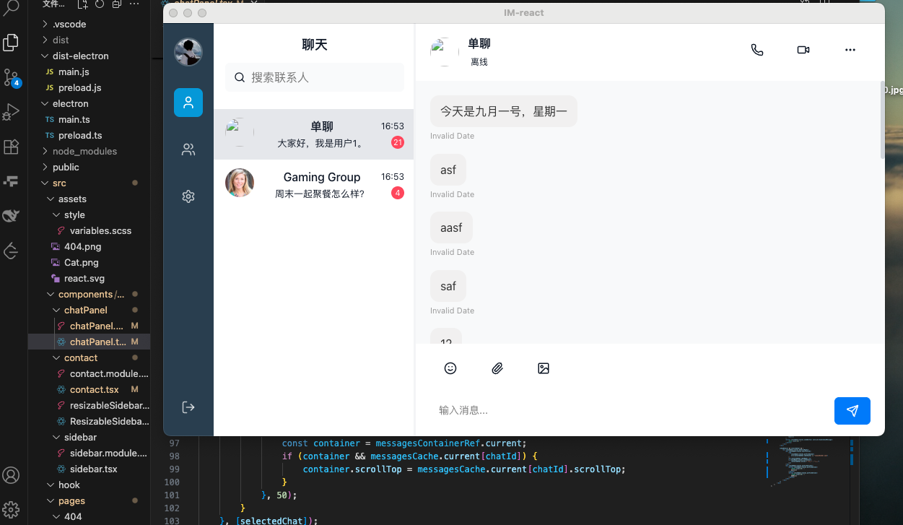

# 💬 React Chat

## 📖 项目说明
**React Chat** 是一个基于 **React + Electron + Vite** 的桌面端即时通讯应用，前后端分离，支持用户登录注册、会话管理、消息收发与存储。  

- **技术栈**：React + Electron + Vite  
- **Node.js 版本**：推荐 `>= 20.18.0`  
- **调试方式**：开发环境中可使用 `Cmd + Shift + I` 打开浏览器开发者工具。  

---

## 🔗 后端项目地址
后端服务仓库：[dolt-y/chat-server](https://github.com/dolt-y/chat-server.git)

---

## 🚀 功能开发进度

### 目前整体ui效果图


### ✅ 已完成
- 登录 / 注册功能  
- 系统整体 UI 布局  
- 用户会话获取  
- 聊天历史消息获取  

### ❌ 待完成
- 聊天消息发送  
- 聊天消息接收  
- 聊天消息存储  
- Redux 状态管理接入  
- 系统 Socket 通信  
- 聊天消息撤回  

---

## 🛠️ 开发环境运行步骤

1. **克隆前端项目**

   ```bash
   git clone https://github.com/your-username/react-chat.git
   cd react-chat
   ```

2. **安装依赖**

   ```bash
   npm install
   ```

3. **启动开发环境**

   ```bash
   npm run dev
   ```

4. **构建**
  
   ```bash
   npm run build
   ```
